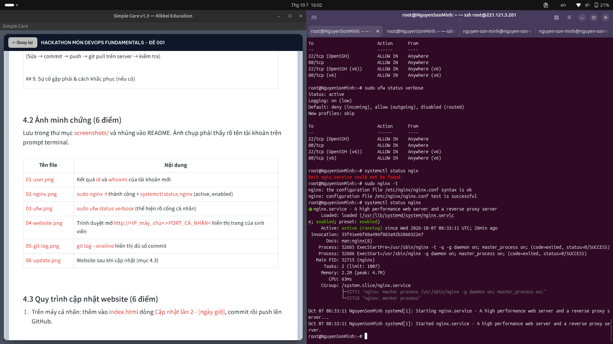
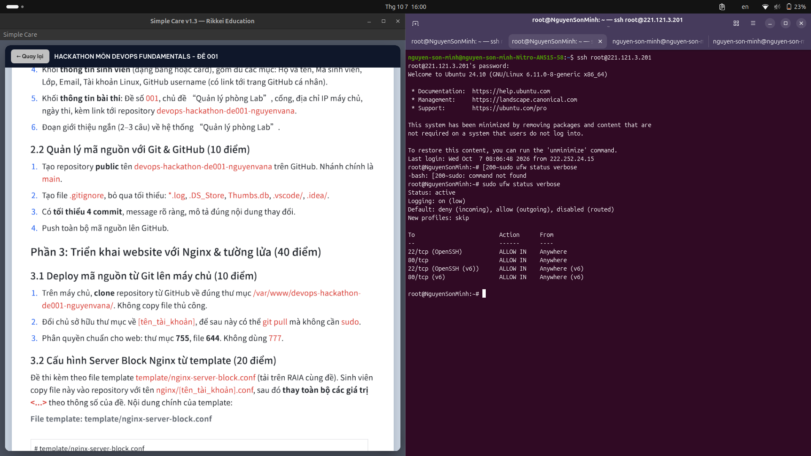
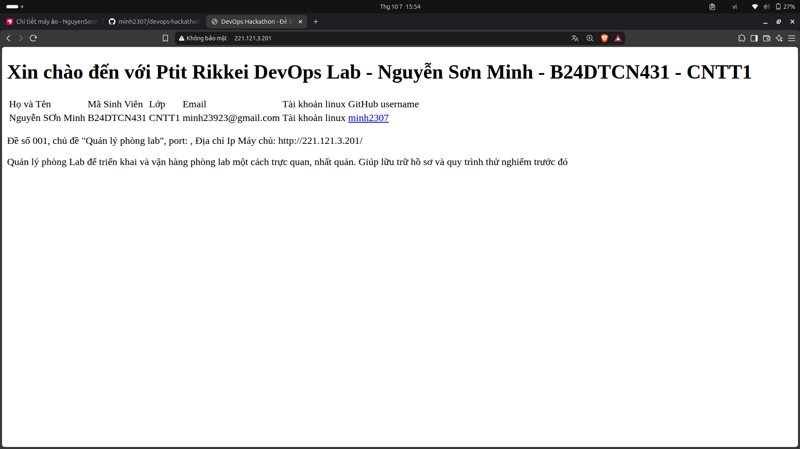

#devOps Hackathon - Đề 001: Quản lý phòng lab

##1. Thông tin sinh viên
|Họ và Tên| Mã Sinh viên| Lớp | Tài khoản github | cổng nghix|
|Nguyễn Sơn Minh| B24DTCN431| CNTT1 | minh2307| |

##2. Môi trường triển khai

##3. Cấu trúc dự án

##4. cấu hình ngix

##5. Tường Lửa UFW
root@NguyenSonMinh:~# sudo ufw status verbose
Status: active
Logging: on (low)
Default: deny (incoming), allow (outgoing), disabled (routed)
New profiles: skip

To                         Action      From
--                         ------      ----
22/tcp (OpenSSH)           ALLOW IN    Anywhere                  
80/tcp                     ALLOW IN    Anywhere                  
22/tcp (OpenSSH (v6))      ALLOW IN    Anywhere (v6)             
80/tcp (v6)                ALLOW IN    Anywhere (v6)

##6. Các lệnh đã triển khai
apt update
apt upgrade -y
apt install ufw -y
ufw allow OpenSSH
ufw allow 80/tcp
ufw enable
apt install nginx -y
systemctl status nginx
curl http://221.121.3.201/
nano /var/www/html/index.html

##7. kiểm tra & minh chứng

##8. Quy trình cập nhập website

##9. Sự cố gặp phải && cách khắc phục

Sự cố:
nguyen-son-minh@nguyen-son-minh-Nitro-AN515-58:~$ ssh root@221.121.3.201
@@@@@@@@@@@@@@@@@@@@@@@@@@@@@@@@@@@@@@@@@@@@@@@@@@@@@@@@@@@
@    WARNING: REMOTE HOST IDENTIFICATION HAS CHANGED!     @
@@@@@@@@@@@@@@@@@@@@@@@@@@@@@@@@@@@@@@@@@@@@@@@@@@@@@@@@@@@
IT IS POSSIBLE THAT SOMEONE IS DOING SOMETHING NASTY!
Someone could be eavesdropping on you right now (man-in-the-middle attack)!
It is also possible that a host key has just been changed.
The fingerprint for the ED25519 key sent by the remote host is
SHA256:g7KOtk7baGxMnjCm1+JEl85Z/be86VdXhjpjZWecFtg.
Please contact your system administrator.
Add correct host key in /home/nguyen-son-minh/.ssh/known_hosts to get rid of this message.
Offending ECDSA key in /home/nguyen-son-minh/.ssh/known_hosts:14
remove with:
ssh-keygen -f '/home/nguyen-son-minh/.ssh/known_hosts' -R '221.121.3.201'
Host key for 221.121.3.201 has changed and you have requested strict checking.
Host key verification failed.

Cách khắc phục: chạy dòng lệnh ssh-keygen -f '/home/nguyen-son-minh/.ssh/known_hosts' -R '221.121.3.201'
